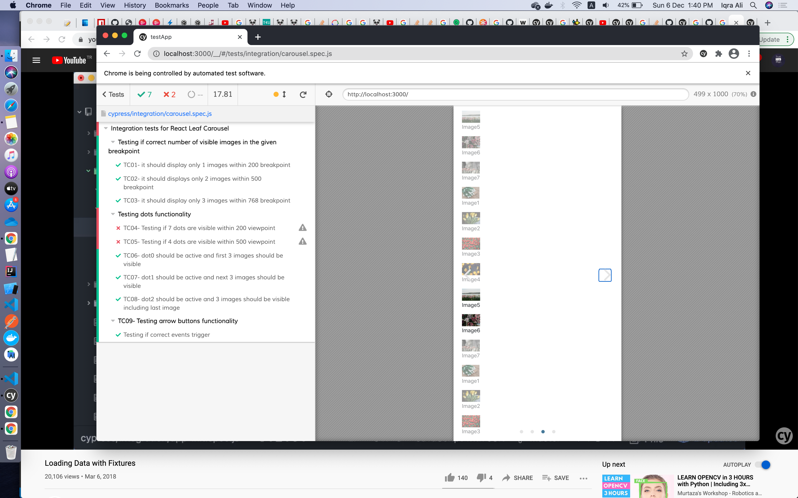

## Findings  
Following are the prompt know issues or bugs which I came across during testing. Beacuse of unexpected behaviour of image visibility, the lazy loading functionality cannot be tested.

> [IA001]
-  While controling image visibility from the breakpoint adjustment, left image to left-most visible images is always visible, whereas it should not. 
   e.g. 
   - There are 7 images in the slider in the right sequence.  Img1, Img2, ..., Img7 
   - Expected: Only Img1-Img2-Img3 are expected to be visible within the given breakpoint.
   - Actual:  Img7 is also visible which is not expected    

-  While controling image visibility from the dots, image visibility behaviour is almost the same except a few instances where both the right to the right-most and left to the lef-most images are visble, whereas they should not be visible.   

>[IA002]
- Found by manual testing. 
- At multiple button click the slider images are shown vertically. Screenshots are attached for clarity! 

